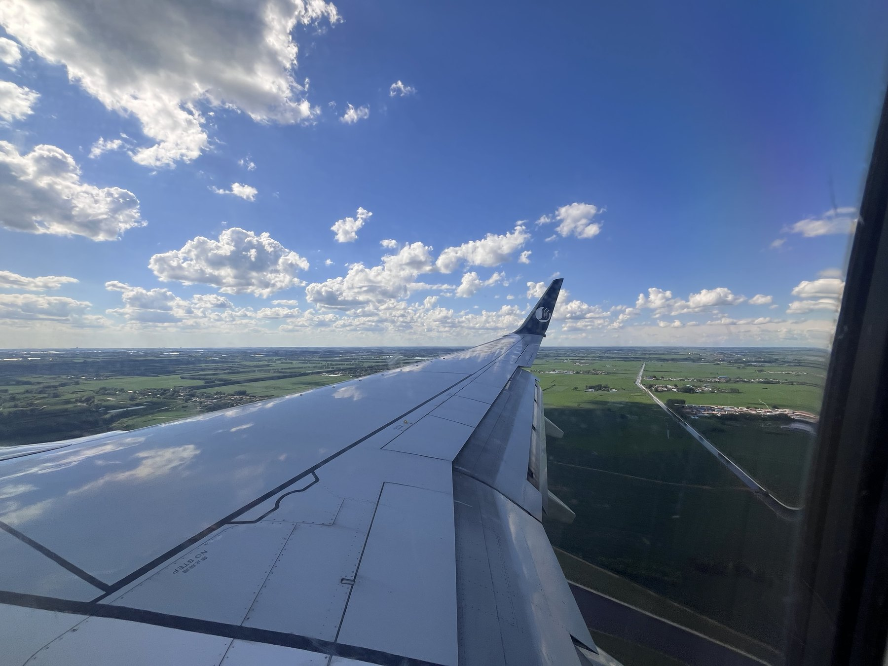
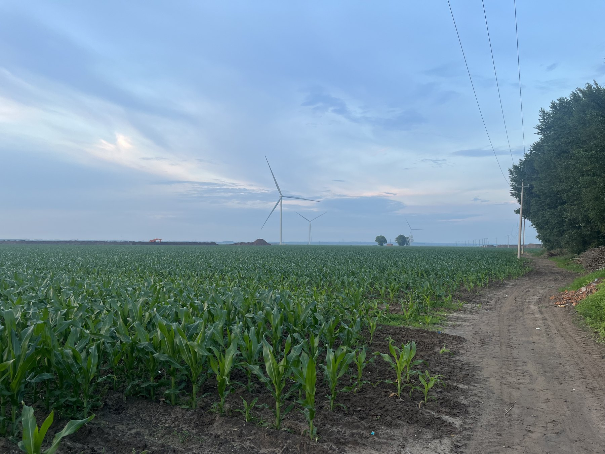
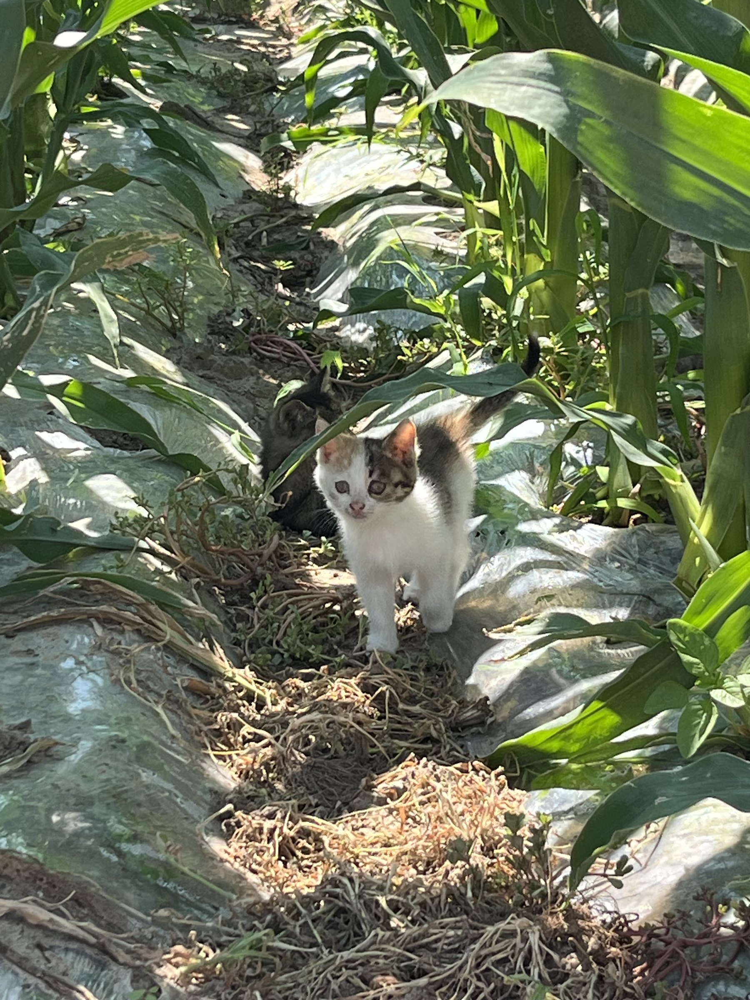
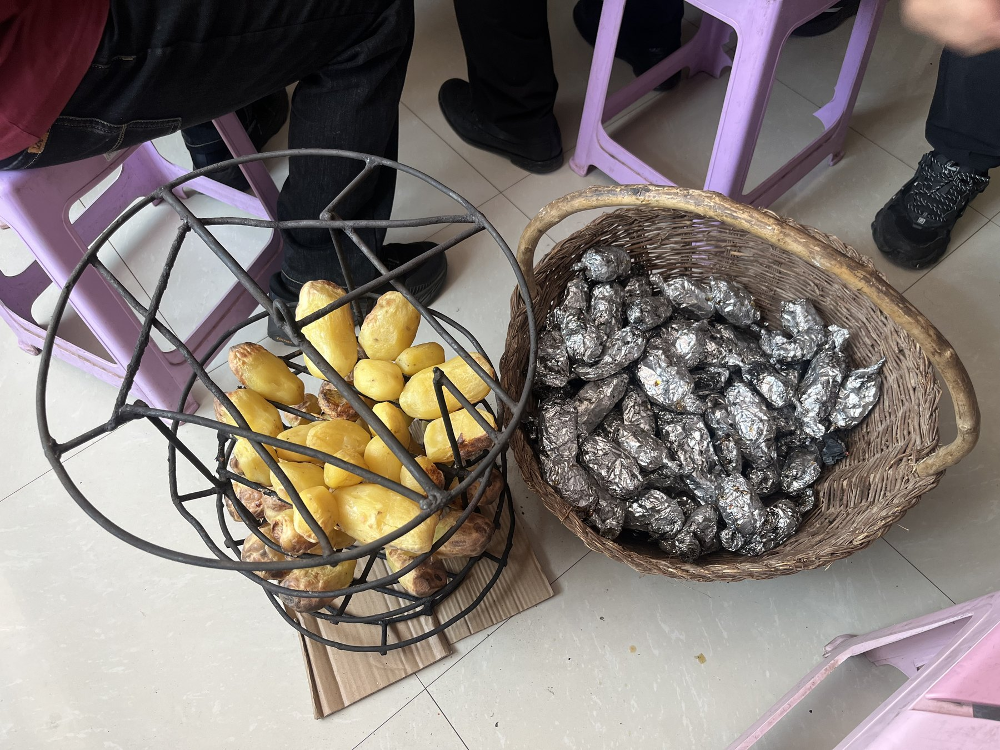
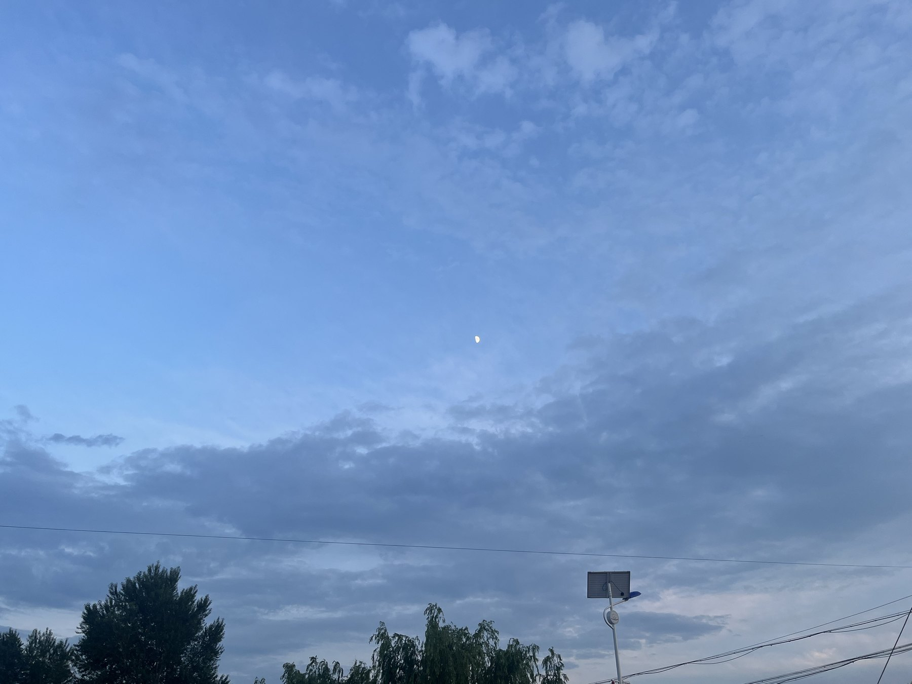

# 吉林

这次回老家，照片没有刻意拍得很完整，反而更像是一路上随手留下来的几个片段：飞机落地前的云、田边的风、地里突然出现的小猫、家里热乎的吃的，还有傍晚抬头看到的天。

快落地的时候，从舷窗往外看，下面是一大片平整的绿色。云压得很低，机翼把视线切成两半，那一刻会突然有一种“真的回来了”的感觉。

玉米地还没长到最高，风机在远处慢慢转。土路、树、田和天连在一起，看起来没有什么特别的景点，却很有吉林的开阔。

在地里遇到一只小猫。它从玉米叶子下面走出来，身上还有一点阳光。照片有点糊，但刚好像这趟回家路上的一个小插曲。

回家以后，吃的东西总是比照片本身更有记忆点。烤土豆放在筐里，旁边还有一堆包着锡纸的热乎东西，这种画面很难不让人觉得踏实。

晚上的天还没完全暗，月亮先挂在云里。路灯、电线和树影都很普通，但这种普通反而最像老家的日常。

