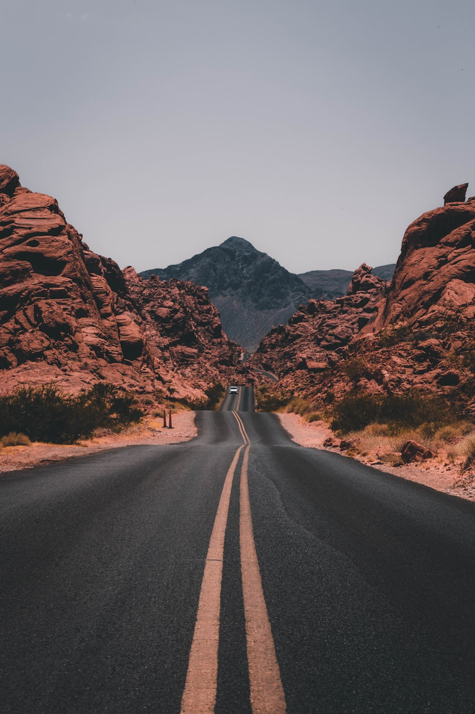
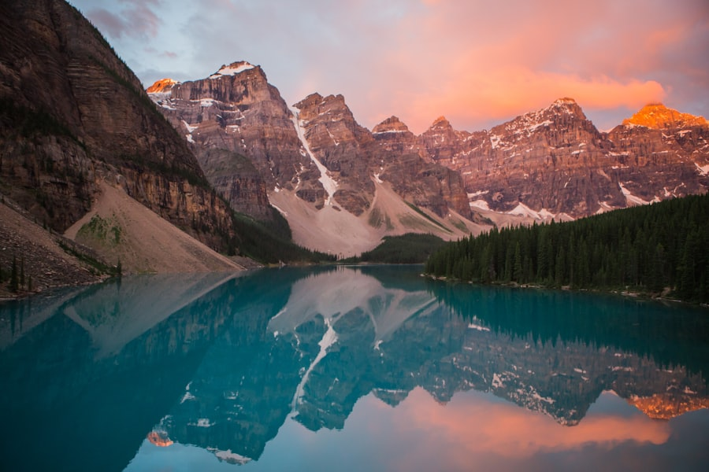
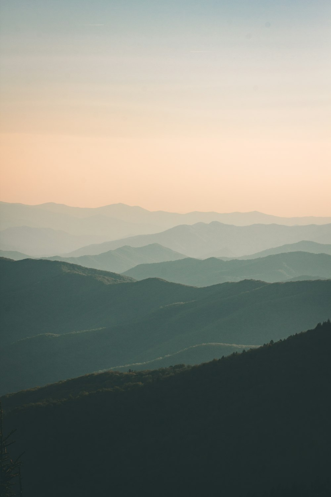

# 山间周末

这个相册先用几张临时照片试一下图文记录的感觉。以后如果换成自己的照片，只需要替换图片文件和这篇 Markdown 里的文字。

傍晚之后天色慢慢暗下来，山的轮廓变得很安静。照片本身不需要解释太多，只是想把那一刻的空气留下来。

第二天早上走进树林，光从树缝里落下来。这样的照片适合配一点短文字，不像普通照片墙那么冷。

回程路上随手拍了一张。相册如果做成这种图文记录，以后就可以既放照片，也写一点当时的心情。
